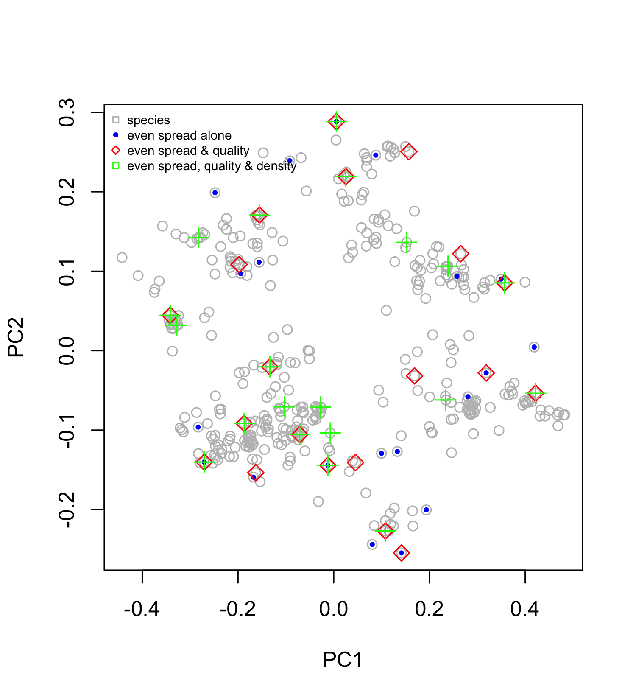

# Species choice analysis

This analysis is about hedging our bet of which species will successfuly form a functioning and persistent coral reef in the future. The aim is to construct an objective analytical framework for selecting of *n* species to focus on for restoration or other forms of preservation. There are two key components of the framework. The first is selecting a broad range of life histories using trait space as our template. This step is important because there are physiological and demographic trade-offs among species. Species good at one life history strategy (e.g., growing fast) tend to be poor at others (e.g., surviving storms or reproducing). The key second component is prioritising species with demonstrated qualities that are expected to help them persist in uncertain future environments. For instance, species with higher abundances and larger geographic range sizes tend to recovery faster from disturbances, and also have more genetic diversity that facilitates evolvution to novel conditions via selection, because drift is less pervasive. Additionally, species that are evolutionary older may also be expected to deal with change better; although, older species have also been shown to be more prone to extinction in analyses of marine fauna in Phanerozoic fossil records.

So, the anlytical basis hedges our bet by:

1. Selecting an *even* range of functionally important traits, including morphology, physiology and demography. 
2. Weighing certains species more-so based on regional abundance, geographic range size, and extinction survival.
3. Capturing high genetic and phylogenetic diversity, and therefore a range of sensitivities to future stressors. This can be tested later.

### Analysis

##### Step 1: Trait space

We used trait data from [this paper](https://www.pnas.org/content/115/12/3084.short), which includes numerical (1-5) trait values for all species. The data is available [here](https://research.jcu.edu.au/researchdata/default/detail/2d343a3dc21a6a25831f3fbaa508efa7/). The traits are selected to represent the functional importance of corals. They are:

- Growth rate (GR)
- Corallite width (CW)
- Rugosity/branch spacing (R)
- Surface area per unit volume (SAV)
- Colony height (CH)
- Maximum colony size/diameter (MCS)
- Skeletal density (SD)

Figure 3 of the original paper shows that a PCoA (principal coordinates analysis) of these traits separates out the major morphological groups, and that the GBR has different occupancy to the Caribbean due to the lack of branching corals. Each point is a species and the contours show dense clusters:

 

 

The trait vectors indicate the areas of trait space that bring high trait values. The axes reflect trade-offs, e.g. between growth and corallite size on axis 1, which captures a range of demographic and physiological variation, and height and skeletal density/surface area on axis 2:

 

 

##### Step 2: Even spread in trait space

To generate species (points) with maximum spread in trait space we used [voronoi mosaics](https://en.wikipedia.org/wiki/Voronoi_diagram), which evenly partition the space between neighbouring points, and uses partitions to construct cells for each point:

 

 

By iteratively removing the points occupying the smallest cells we are left with *n* points with maximum spread. When we apply this function to trait space using **20 species**, it looks like this:

 

> Which gives the following 20 species names: HIDDEN

The above species are selected over three PC axes, but display only on axes 1 and 2. The third principal component aligns strongly with colony size. Here is the select in three dimensions:

 

Explore the 3D plot [here](https://mikemcwilliam.github.io/webGL/index.html).

At this point we have a list of 20 species that are most evenly spread in trait space, and so capture a broad range of trade-offs and thereby a higher chance of forming a functioning coral assemablge. 

##### Step 3: Weigh by qualities

The final step is to weight species selection by demonstrated qualities that are expected to help them persist. We still need to discuss how to do this, but for this demonstration we used the following criteria from the coral traits database:

- [GBR Abundance](https://coraltraits.org/traits/65) categories from Corals of the World (common=1; uncommon=0.25; rare=0.1).
- [Range size](https://coraltraits.org/traits/138) from Hughes et al. shapefiles (scaled as relative area between 0 and 1).
- [Genus fossil age](https://coraltraits.org/traits/116) from Paleobiology DB (scaled as relative age between 0 and 1).

The voronoi cell areas (from Step 2) are simply multiplied by each of these qualities. So, a species's cell area remains the same if it is common, large ranges and old-aged. When we do this, the voronoi function favours species with even spread in trait space and higher qualities deemed important.

 

 

> Which gives the following 20 species names: HIDDEN

We are also exploring *density* in PC space, which weighs species from clusters of species in trait space more (or less) heavily (scaled between 0 and 1). This needs discussion, but presumably species cluster evoluntionary in certain regions of trait space for a reason.

 

 

> Which gives the following 20 species names: HIDDEN

##### Step 4: Do species represent potential winners, losers or both?

We had a quick look at this question using bleaching sensitivity index using data from [this paper](https://onlinelibrary.wiley.com/doi/abs/10.1111/gcb.13276). The selected species (red points) have a large range of bleaching sensitivities compared to the total distribution (histogram), but they do not include the most sensitive species:

 

 

### Still to do

- Gather species-level abundance data for GBR species to weigh species selection
- Decide on how to generate index of 'desirability' to weigh selection
- Test whether selected species represent a large genetic diversity
- Restorability?
- Reproductive traits?
- Compare with expert species choice (the reason we haven't shown our results!)
