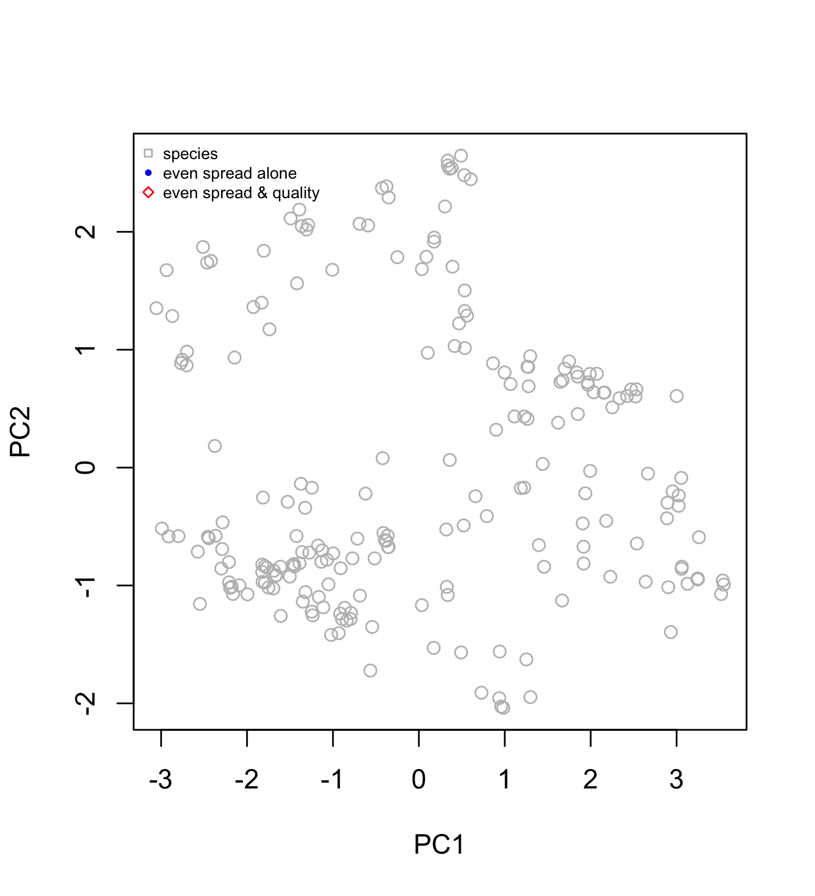

# Species choice analysis

This analysis is about hedging our bets for the future. The aim is to construct a framework that generates a selection of n species with:  

1. an even **range** of functionally important traits, including morphology, physiology and demography. This is important, because species 
2. **maximimum** regional abundance, geographic range, and extinction survival
3. Ideally, the high range of trait space will also capture a high genetic and phylogenetic diversity, and a range of sensitivities to future stressors. This can be tested later.

# Analysis

#### Step 1: Construct trait space

We used trait data from [this paper](https://www.pnas.org/content/115/12/3084.short), which includes numerical (1-5) trait values for all species. The data is available [here](https://research.jcu.edu.au/researchdata/default/detail/2d343a3dc21a6a25831f3fbaa508efa7/). The traits are selected to represent the functional importance of corals. They are:

- Growth rate (GR)
- Corallite width (CW)
- Rugosity/branch spacing (R)
- Surface area per unit volume (SAV)
- Colony height (CH)
- Maximum colony size/diameter (MCS)
- Skeletal density (SD)

Figure 3 of the original paper shows that a PCoA (principal coordinates analysis) of these traits separates out the major morphological groups, and that the GBR has different occupancy to the Caribbean due to the lack of branching corals. Each point is a species and the contours show dense clusters:

 

 

The trait vectors indicate the areas of trait space that bring high trait values. The axes reflect trade-offs, e.g. between growth and corallite size on axis 1, which captures a range of demographic and physiological variation, and height and skeletal density/surface area on axis 2:

 

 

#### Step 2: Find species with high spread

To generate species (points) with maximum spread in trait space we used [voronoi mosaics](https://en.wikipedia.org/wiki/Voronoi_diagram), which evenly partition the space between neighbouring points, and uses partitions to construct cells for each point:

 

  

By gradually removing the points occupying the smallest cells we are left with points with maximum spread. When we apply this function to trait space using **20 species**, it looks like this:

 

  

Including more dimensions captures more trait variation, which is especially important in this trait space where the third principal component aligns strongly with colony size. Therefore, it may be more informative to construct this analysis in three dimensions:

 

  <b>Explore <a href=https://mikemcwilliam.github.io/webGL/index.html >here</a> 

   

#### Step 3: Weigh species selection by "desirability" index

We still need to discuss how to do this, but for this demonstration we used the following criteria from the coral traits database:

- [Abundance](https://coraltraits.org/traits/65) categories from Corals of the World (common=1; uncommon=0.25; rare=0.1)
- [Range size](https://coraltraits.org/traits/138) scaled between 0 and 1
- [Genus fossil age](https://coraltraits.org/traits/116) scaled between 0 and 1
- Multiply each together to get weighting/desirability

When we do this, the voronoi function changes some of it's selections to favour species with higher 'desirability' indicated by point size below.

 

 

Which gives the following species:

 

 

#### Step 4: Do species represent potential winners, losers or both?

We had a quick look at this question using bleaching sensitivity index using data from [this paper](https://onlinelibrary.wiley.com/doi/abs/10.1111/gcb.13276)

The selected species (red points) have a large range of bleaching sensitivities compared to the total distribution (histogram), but they do not include the most sensitive species:

 

 

# Still to do

- Gather species-level abundance data for GBR species to weigh species selection
- Decide on how to generate index of 'desirability' to weigh selection
- Test whether selected species represent a large genetic diversity
- Restorability?
- Reproductive traits?
-
